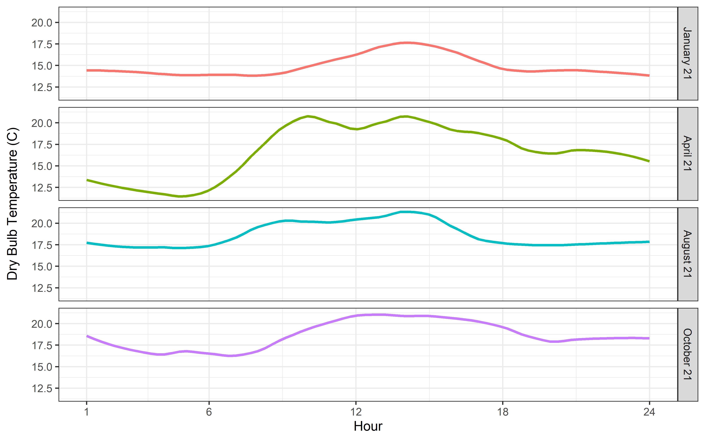
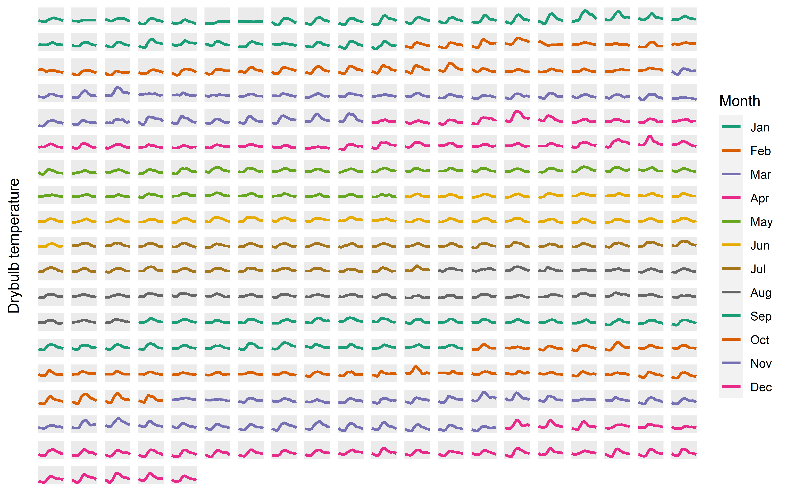

```{r setup, include=FALSE}
knitr::opts_chunk$set(echo = TRUE)
library(tidyverse)
```

## Clear global env and report

```{r include=FALSE}
rm(list = ls())
gc()
```

# Intro

In this instance, I am using Zone Ideal Air Loads extracted from a `in.idf` with the weather file `USA_CA_Los.Angeles.Intl.AP.722950_TMY3.ddy`. The Zone Ideal Load Air System ("ILAS") `colnames` were `str_replace`d to match the `Name` field of the `Zone` object in the precedent file `0_RVESO.Rmd`. This file also exported a R data file object `ILAS.Rda`. In this file `1_CLUS.Rmd` we will import both Ideal Load Air System data and weather data via the connector package `eplusr`. We will visualize this data for exploration. We will create report figures. We will attempt clustering of the ideal air loads for a subset of 8760 observations. Note that the nth observation in the `hour` variable corresponds to the average of the period from (n-1)th hour to nth hour.

## Import EPW

The R package `eplusr` contains useful functions and an `Epw` object for easily reading and writing weather data in the .epw file format.

```{r include=FALSE}
library(eplusr)
epw <- eplusr::Epw$new("USA_CA_Los.Angeles.Intl.AP.722950_TMY3.epw")

# good info
epw$typical_extreme_period()
paste0("The number of time intervals per hour is ",epw$interval())
paste(colnames(epw$data()), collapse = ", ")
epw$data() %>%
  select(month, day, hour, dry_bulb_temperature)
```

## Import Rda of Zone Ideal Loads Air System

```{r import, message=FALSE, warning=FALSE}
load(file = "ILAS.Rda")
```

### Select four days to cluster in 24-d vector

I have selected the following dates of interest: January 21, April 21, August 21, and October 21 from preliminary visualization in the Climate Consultant desktop app. I create two vectors, `days_of_interest = c(21)` and `months_of_interest = c(1,4,8,10)` then use a pipe `filter` to get my result. As of now there are two separate dataframes, `epw` for weather and `ILAS` for Zone Ideal Loads.

```{r}
# change to numeric format of `day` and `month`
days_of_interest <- c(21); months_of_interest <- c(1,4,8,10)

sel_days_ILAS <- ILAS %>%
  filter(day %in% days_of_interest, month %in% months_of_interest)

```

```{r}
sel_days_epw <- epw$data() %>%
  select(month, day, hour, dry_bulb_temperature) %>%
  filter(day %in% days_of_interest, month %in% months_of_interest)
```

After that filter is done, I assert that it is `r nrow(sel_days_ILAS)==96` that I have 96 (4 x 24) observations.


# Visualizations 

Under this section I have code that opens the `grDevices` connection and writes custom figures to bitmap files in the containing folder. The image outputs are shown below.

### faceted ggplot for select 4 days

```{r RUN FOR 4 IMAGE, eval=FALSE, include=FALSE}
library(ggplot2)
# Jan, Apr, Aug, Oct

x <- sel_days_epw

# set resolution
png("4days.png", units = "in", width = 8, height = 5, res = 500)

# have to tell aes that the variable is a discrete `factor`
p <- ggplot(x, aes(x = hour, y = dry_bulb_temperature, color = factor(month))) + geom_smooth(se = F, span = 0.3)

# new facet label names for month variable
month.labs <- c("January 21","April 21","August 21","October 21")
names(month.labs) <- months_of_interest

p + facet_grid(rows = vars(month), labeller = labeller(month = month.labs)) + scale_color_discrete(name = "Month", labels = month.name[months_of_interest]) + scale_x_continuous(name = "Hour", breaks = c(1,6,12,18,24)) + theme_bw() + theme(legend.position = "none", axis.title.y = element_text(margin = margin(r=10))) + labs(y = "Dry Bulb Temperature (C)")

dev.off()
```

Dry bulb temperature versus hour for four select days in the typical Los Angeles meteorological year: 

### faceted ggplot for 365 days

```{r eval=FALSE, include=FALSE}
# make unique day index 1..365
d <- nrow(ILAS)/24
d_ind <- rep(1:d, each = 24)

# alternative 2 with iteration
# c_vec <- vector(mode = "numeric", nrow(ILAS)) # instantiate
# for (i in length(c_vec)) { # control flow
#   if (logic) {i <<- i + 1} # iterator
# }

```


```{r RUN FOR 365 IMAGE, eval=FALSE, include=FALSE}
library(ggplot2)
# Jan 31 days
sel_days_epw <- cbind(d_ind, epw$data()) %>%
  select(d_ind, month, day, hour, dry_bulb_temperature) %>%
  filter(month %in% c(1:12))

x <- sel_days_epw

# set resolution
png("365.png", units = "in", width = 8, height = 5, res = 500)

# custom color palette named vector
colorv <- rep( 
  RColorBrewer::brewer.pal(8, name = "Dark2"),
  length.out = 12)
names(colorv) <- 1:12

# have to tell aes that the variable is a discrete `factor`
p <- ggplot(x, aes(x = hour, y = dry_bulb_temperature, color = factor(month))) + geom_smooth(se = F, span = 0.35)

p + facet_wrap(~d_ind) + scale_color_manual(name = "Month", labels = month.abb, values = colorv) + scale_x_discrete(labels = NULL) + scale_y_discrete(labels = NULL) + theme(strip.background = element_blank(), strip.text.x = element_blank(), axis.title.y = element_text(margin = margin(r=12))) + labs(x = NULL, y = "Drybulb temperature")

dev.off()
```

Dry bulb temperature versus time of the full 365 days of the typical meteorological year for Los Angeles: 


# Clustering

### TODO - take ILAS from one day, January 21

You might think that we'd only have heating loads on the winter extreme day, but in this model and climate, we find that there is more building cooling load than heating load.

Traditionally, we would remove columns with zero variance as they are unhelpful in the sense of regression. However, in clustering we may want to leave them in.

```{r}
days_of_interest <- c(21); months_of_interest <- c(8)

sel_days_ILAS <- ILAS %>%
  filter(day %in% days_of_interest, month %in% months_of_interest)

# transpose col variables to observation rows
# a matrix-like object must have the same class for all cols
# for a transpose
# colnames(sel_days_ILAS)

# t
# need col names
t <- as.data.frame(t(sel_days_ILAS))
colnames(t) <- sel_days_ILAS$hour

# "the standard deviation is zero"?
# visdat::vis_cor(sel_days_ILAS)

# let's find which columns have zero variance
a <- which(apply(sel_days_ILAS, 2, var) == 0)

# are there any zones with neither heating nor cooling?
# we assert that 'no'
# get zones that str match with "cooling"
zero_var_col <- colnames(sel_days_ILAS)[a]
c <- grep("*\\Dooling", zero_var_col, value = TRUE)
# get zones that str match with "heating"
h <- grep("*\\Deating", zero_var_col, value = TRUE)

# extracts zone name logic
c <- str_extract(c,"(?<=SYSTEM\\s).*(?=\\:)")
h <- str_extract(h,"(?<=SYSTEM\\s).*(?=\\:)")

intersect(c,h)
```

In `r month.name[months_of_interest]`, we find that there are `r length(c)` zones (3 for Jan + Apr) with no cooling load and `r length(h)` zones (54 for Jan + Apr) with no heating load. We assert that `r length(intersect(c,h))` have neither cooling nor heating load.

What's going on? No cooling/heating energy in `CORRIDOR_2`, `CORRIDOR_3`, or `CORRIDOR_4`. They must be unconditioned.


### TODO - transpose and cluster

Can we just leave in heating and cooling for clustering? Obviously the heating loads will be NULL during the cooling season.

### TODO - tree and look from terminal nodes up

# End

<br><br><br>