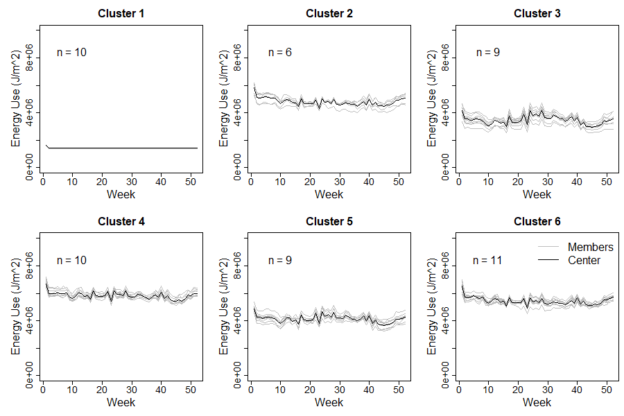

```{r setup, include=FALSE}
knitr::opts_chunk$set(echo = TRUE)
library(tidyverse)
```

### Clear global env and report

```{r include=FALSE}
rm(list = ls())
gc()
```

# Intro

Intro goes here.

## Import Rda data

```{r import, message=FALSE, warning=FALSE}
load(file = "~/MORmod_R/files/hvac_dhw_var.Rda")
```

### Set data

```{r}
# CHANGE DATA HERE
df <- hvac_dhw_var
```

# Feature normalization

Normalize values by floor area of the respective zone.

## Area to Zone mapping

Load in an external data set of rows with two attributes: zone name and floor area in m^2. Since the zone-area dataset and the Ideal Air Loads dataset may have different order, create a simple indexing function.

### Normalize Loads by Floor Area

```{r message=FALSE, warning=FALSE}

### Drop Date/Time and save for later
time_cols <- select(df, c(hour, day, month, hour_index))
rownames(time_cols) <- rownames(df) # need to keep row labels
df <- select(df, -c(hour, day, month, hour_index)) 

### Load Area Map
area_map <- read_csv("~/MORmod_R/files/ZoneFloorArea-Map.csv")

maps_zone_to_area <- function(string) { # takes zone string and maps to zone index in area_map
  which(string==area_map$`Zone List`) # returns num vec
  }

area_idx <- sapply(colnames(df), maps_zone_to_area) # maps df idx to area idx
area_vec <- area_map$`Space Area [m2]`[area_idx]

# apply normalization vector across columns
df <- sweep(df, 2, area_vec, FUN = "/") 

# change units
# **[J]** => [J/m^2]
rownames(df) <- str_replace(rownames(df), "(?<=\\[)J{1}", "J/m^2")

### Add Date/Time back in
df <- cbind(time_cols, df)
```


# Clustering

You might think that they would only be heating loads on the winter extreme day, but in this building type and climate, we find that there is more building cooling load [J] than heating load even during winter.

Traditionally, we would remove columns with zero variance as they are unhelpful in the sense of regression. However, in clustering we may want to leave them in.

## AP cluster

Let's introduce the `apcluster` package which is an implementation of Frey and Dueck's popular Affinity Propagation method for passing messages between pairs of data. I would make sure to reference the [math paper](https://doi.org/10.1080/19401493.2017.1410572), the [R package](https://doi.org/10.1093/bioinformatics/btr406), and the [original method's](https://doi.org/10.1126/science.1136800) publication.


```{r turnkey cluster process, message=FALSE}
library(apcluster)


# drop time date cols in
# preparation for clustering
if ("minute" %in% colnames(df)) {
  df <- subset(df, select = -c(day, hour, hour_index, month, minute))
} else {
  df <- subset(df, select = -c(day, hour, hour_index, month))
}

tdf <- as.data.frame(t(df))

APR <- apcluster(negDistMat(r=2), tdf, details = TRUE) # returns a APResult

print(paste0("The number of clusters is ",length(APR@clusters),"."))

k_all_4_compare <- length(APR@clusters)

area_map <- read_csv("~/MORmod_R/files/ZoneFloorArea-Map.csv")

maps_zone_to_area <- function(string) { # takes zone string and maps to zone index in area_map
  which(string==area_map$`Zone List`) # returns num vec
  }

ap_idx <- as.integer(APR@idx)


ap_idx_reindex <- vector(mode = "numeric")
for (i in 1:length(ap_idx)) {
  n <- which(ap_idx[i]==unique(ap_idx))
  ap_idx_reindex <- append(ap_idx_reindex, n)
}

ap_idx_reindex
method_ap <- ap_idx_reindex
# zone names
zone_names <- colnames(df)
```

## k-means clustering

Link to [clustering](https://www.statmethods.net/advstats/cluster.html) in R webpage.

```{r}
set.seed(3)
df <- tdf
kmR <- kmeans(df, centers = k_all_4_compare, algorithm = "Hartigan-Wong")
as.integer(kmR$cluster) # these are idential cluster results
method_k_seed3 <- as.integer(kmR$cluster)

set.seed(4)
df <- tdf
kmR <- kmeans(df, centers = k_all_4_compare, algorithm = "Hartigan-Wong")
as.integer(kmR$cluster) # these are idential cluster results
method_k_seed4 <- as.integer(kmR$cluster)
```

## Ward Hierarchical Clustering

Compare to affinity propagation per Gregor Henze's request.

* Ward clustering
* Complete linkage clustering
* Average linkage clustering
* Single linkage clustering

```{r}
d <- dist(df, method = "euclidean") # distance matrix
clus_ward <- hclust(d, method = "ward.D")
clus_comp <- hclust(d, method = "complete") 
clus_avg <- hclust(d, method = "average") 
clus_single <- hclust(d, method = "single") 

# Ward
plot(clus_ward, cex = 0.8) # display dendogram
groups <- cutree(clus_ward, k=k_all_4_compare)
rect.hclust(clus_ward, k=k_all_4_compare, border="red")
#print(as.integer(groups))
method_ward <- as.integer(groups)
```

### Complete linkage clustering

```{r}
# complete clustering
plot(clus_comp, cex = 0.8) # display dendogram
groups <- cutree(clus_ward, k=k_all_4_compare)
rect.hclust(clus_ward, k=k_all_4_compare, border="red")
print(as.integer(groups))
method_complete <- as.integer(groups)
```

### Average linkage clustering

```{r}
# average
plot(clus_avg, cex = 0.8) # display dendogram
groups <- cutree(clus_ward, k=k_all_4_compare)
rect.hclust(clus_ward, k=k_all_4_compare, border="red")
print(as.integer(groups))
method_avg <- as.integer(groups)
```

### Single linkage clustering

```{r}
# single
plot(clus_single, cex = 0.8) # display dendogram
groups <- cutree(clus_ward, k=k_all_4_compare)
rect.hclust(clus_ward, k=k_all_4_compare, border="red")
#print(as.integer(groups))
method_single <- as.integer(groups)
```

### Compare Ward to AP (per GH)

The `hclust()` function implements hierarchical clustering in R. In the following example we use the data from Section 10.5.1 to plot the hierarchical clustering dendrogram using complete, single, and average linkage clustering, with Euclidean distance as the dissimilarity measure. We begin by clustering observations using complete linkage. The `dist()` function is used to compute the 50 × 50 inter-observation Euclidean distance matrix.


```{r}
library(stats)
set.seed (2)
x = matrix (rnorm (50*2) , ncol =2)
x[1:25 ,1] = x[1:25 ,1]+3
x[1:25 ,2] = x[1:25 ,2] -4

set.seed(5) # hclust not sensitive to random seeding
hc.complete = hclust(dist(x), method ="complete")
hc.average = hclust(dist(x), method ="average")
hc.single = hclust(dist(x), method ="single")

```


We can now plot the dendrograms obtained using the usual plot() function. The numbers at the bottom of the plot identify each observation.

```{r}
# par(mfrow =c(1,3))
# plot(hc.complete, main ="Complete Linkage ", xlab="", sub ="", cex =.9)
# plot(hc.average, main ="Average Linkage ", xlab="", sub ="", cex =.9)
# plot(hc.single, main="Single Linkage", xlab="", sub ="", cex =.9)
```

To determine the cluster labels for each observation associated with a given cut of the dendrogram, we can use the `cutree()` function:

```{r}
cutree(hc.complete, 2)
cutree(hc.average, 2)
cutree(hc.single, 2)
```

For this data, complete and average linkage generally separate the observations into their correct groups. However, single linkage identifies one point as belonging to its own cluster. A more sensible answer is obtained when four clusters are selected, although there are still ~~two~~ one singletons.

```{r}
cutree(hc.single , 4)
```

To scale the variables before performing hierarchical clustering of the observations, we use the `scale()` function:

```{r}
# xsc=scale(x)
# plot(hclust(dist(xsc), method ="complete"), main ="Hierarchical Clustering with Scaled Features")
# # this changed the height y-axis scale but not the clustering groups
```

Make a matrix to compare cluster members across algorithms

```{r}
export_df <- cbind(zone_names, method_ap, method_k_seed3, method_k_seed4, method_ward, method_complete, method_avg, method_single)
write.csv(export_df, file = "algorithm_compare_k_all_4_compare.csv")
```


# Ward Hierarchical Clustering with Bootstrapped *p*-values

Bootstrapping dendograms with pvclust. "Hierarchical clustering is done for given data and *p*-values (probability values) are computed for each of the clusters." Function `pvclust()` conducts multiscale bootstrap resampling to calculate *p*-values for each cluster in the result of hierarchical clustering. The default number of bootstraps `nboot` is 1000.

The *p*-values between 0 and 1 indicates how strong the cluster is supported by data. AU (Approximately Unbiased) p-value and BP (Bootstrap Probability) value. AU p-value, which is computed by multiscale bootstrap resampling, is a better approximation to unbiased p-value than BP value computed by normal bootstrap resampling.

Clusters with AU larger than 95% are highlighted by red rectangles, which are strongly supported by data.

```{r}
library(pvclust)
# pvclust clusters columns
# pvclust is bootstrapped
#pvclust_result <- pvclust(t(df)[1:20, 1:20], method.hclust="ward.D", method.dist="euclidean")
pvclust_result <- pvclust(t(df), method.hclust="ward.D", method.dist="euclidean", nboot = 50)

plot(pvclust_result) # dendogram with p values
# add rectangles around groups highly supported by the data
pvrect(pvclust_result, alpha=.95)
#pvclust::msplot(pvclust_result, edges = 14)
```

The results from this bootstraping (similar to Monte Carlo methods) shows that there is great clustering certainty in separating common areas from apartment spaces but there is not great confidence in clustering apartments otherwise.

## Dynamic Time Warp Clustering with `dtwclust`

This takes way too long (20+ min for 59 observations of 5 variables). Cite Espinoza for technical reasons that it takes so long.

## Model Based Clustering

Packages like `mclust` take a very long time. Not practical.

# Load week downsampled data

```{r}
# Perform clustering analysis on...

load("../downsampling_compare/hvac_dhw_var_week.Rda")
df <- hvac_dhw_var_week # group_by() verb previously used destroyed rownames
# values are NOT area normalized
```

### Normalize Loads by Floor Area

```{r warning=FALSE}

### Drop Date/Time and save for later
# time_cols <- select(df, c(hour, hour_index, day, month))
# rownames(time_cols) <- rownames(df) # need to keep row labels
# df <- select(df, -c(hour, hour_index, day, month)) 

### Load Area Map
area_map <- read_csv("~/MORmod_R/files/ZoneFloorArea-Map.csv")

maps_zone_to_area <- function(string) { # takes zone string and maps to zone index in area_map
  which(string==area_map$`Zone List`) # returns num vec
  }

area_idx <- sapply(colnames(df), maps_zone_to_area) # maps df idx to area idx
area_vec <- area_map$`Space Area [m2]`[area_idx]

# apply normalization vector across columns
df <- sweep(df, 2, area_vec, FUN = "/") 

# change units
# **[J]** => [J/m^2]
rownames(df) <- str_replace(rownames(df), "(?<=\\[)J{1}", "J/m^2")

### Add Date/Time back in
# df <- cbind(time_cols, df)
```

```{r}
library(cluster)

png(filename = "6_plot_kmeans.png", width = 900, height = 600)
# Break the set out into an ndays x nmodes (3-hour blocks of the day) matrix for clustering
ndays = 8760/24
idx = seq(from=24, to=8760, by=24)
by_week = as.data.frame(t(df))
daynames = 1:ndays

# Let's use 6 clusters as a reasonable starting point
set.seed(6)
nclust = 6
clust1_kmeans = kmeans(by_week, nclust)
centrs = matrix(nrow = nclust, ncol = 52)

# Plot up the clusters
# plot matrix graphical parameters
par(mfrow=c(2, ceiling(nclust/2)), mai = c(0.7, 0.8, 0.5, 0.1)) # b, l, t, r

for(i in 1:nclust){
	idx = clust1_kmeans$cluster == i
	clustervals = as.matrix(by_week[idx,])
	centrs[i,] = as.integer(clust1_kmeans$centers[i,])  # get line across rows not column
	n = clust1_kmeans$size[i]
	plot(clustervals[1,],type="l",xlab="Week",
	     ylab="Energy Use (J/m^2)",col="gray",ylim=c(1*(10^4),1.0*(10^7)), main=paste("Cluster",i) , cex.axis = 1.8, cex.main = 2.0, cex.lab = 2.0, cex = 1.7)
	if (n>1) {
	  for(j in 2:n){
		  lines(clustervals[j,],typ="l",col="gray")
	  }
	}
	lines(centrs[i,],typ="l",col="black",lty="solid")
	text(10,8.5*(10^6),paste("n = ",n, sep=""), cex = 2.0)

}
legend(x="topright", legend=c("Members", "Center"),
       col=c("gray", "black"), lty=c("solid", "solid"), bty="n", bg="white", cex = 2.0)
dev.off()

```




# End


<br><br><br>