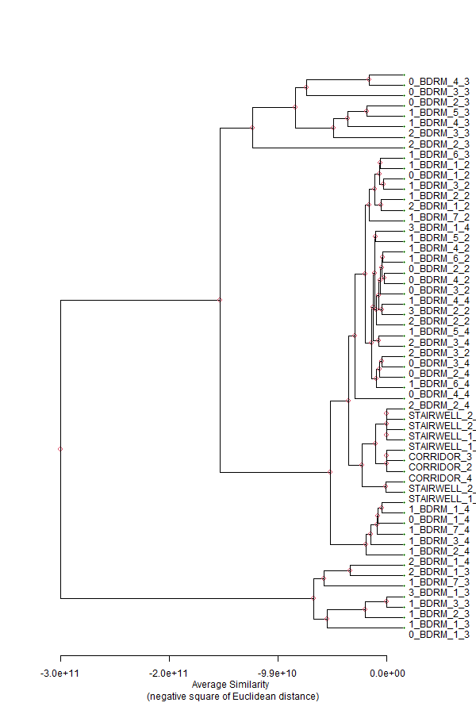

```{r setup, include=FALSE}
knitr::opts_chunk$set(echo = TRUE)
library(tidyverse)
```

## Clear global env and report

```{r include=FALSE}
rm(list = ls())
gc()
```

# Intro

This is my second attempt at clustering of zones using the ideal air loads output variable.

In this instance, I am using Zone Ideal Air Loads extracted from an EnergyPlus `in.idf` with the weather file `USA_CA_Los.Angeles.Intl.AP.722950_TMY3.ddy`. The Zone Ideal Load Air System ("ILAS") numerical `colnames` were `str_replace`d to match the `Name` field of the `Zone` object in the predecessor file `0_RVESO.Rmd`. Loads were normalized by zone floor area. That file also exported a R data file object `ILAS.Rda`. In this file `2_CLUS.Rmd` we will import both Ideal Load Air System data and weather data via the connector package `eplusr`. We will visualize this data for exploration. We will create report figures. We will attempt clustering of the ideal air loads for a subset of 8760 observations. Note that the nth observation in the `hour` variable corresponds to the average of the period from (n-1)th hour to nth hour.

## Import EPW

The R package `eplusr` contains useful functions and an `Epw` object for easily reading and writing weather data in the .epw file format.

```{r include=FALSE}
library(eplusr)
epw <- eplusr::Epw$new("USA_CA_Los.Angeles.Intl.AP.722950_TMY3.epw")

# good info
epw$typical_extreme_period()
paste0("The number of time intervals per hour is ",epw$interval(),".")
paste(colnames(epw$data()), collapse = ", ")
epw$data() %>%
  select(month, day, hour, dry_bulb_temperature)
```

## Import Rda of Zone Ideal Loads Air System

```{r import, message=FALSE, warning=FALSE}
load(file = "ILAS.Rda")
```

### Select N hours to cluster in N-space

Previously, based on the advice of Zahra Fallahi, I chose four select days on which to base my first trial of clustering. Based on the results from the first trial, I saw that even good intentions were not successful in preventing bias in the clustering. Specifically, one of the hours I chose as a parameter happened to coincide with the annual peak cooling load for one of my zones ("1_BDRM_6_3"). For this second trial, I will try to be more cognizant of the most typical (least extreme) and most extreme (least typical) weather periods of the simulation year.

### Get typical and extreme days

The following method leverages the `eplusr` package to identify the most typical weeks of the four North American seasons - Summer, Winter, Autumn, and Spring.

I have used data filtering to the greatest extent but I worry that the number of observations is still too high for later clustering. Remember, zones are my points so hourly observations are actually my parameters after the necessary transform.

```{r include=TRUE}
view_me <- epw$typical_extreme_period()
view_me$name
```

```{r include=FALSE}
# names[c(2,4:6)]
start_dates <- as.character( epw$typical_extreme_period()$start_day[c(2,4:6)] )
end_dates <- as.character( epw$typical_extreme_period()$end_day[c(2,4:6)] )
# => [1] " 08/21" " 4/18" "11/28" " 6/25"

# look ahead regexp for month chars
months_num <- as.numeric( str_extract(start_dates,"\\d+(?=/)") )

# look behind regexp for day chars
start_days <- as.numeric( str_extract(start_dates,"(?<=/)\\d+") )
end_days <- as.numeric( str_extract(end_dates,"(?<=/)\\d+") )

months_of_interest <- months_num # from typical weeks above
hours_of_interest <- 8:20 # hours of operation


num_obs <- ILAS %>%
  filter(month %in% months_of_interest) %>% # 2,904 rows
  filter(hour %in% hours_of_interest) %>%
  nrow() # 1,573 rows
```

The typical week for Summer is: ``r month.abb[months_num][1]`` week starting ``r start_days[1]``; Winter: ``r month.abb[months_num][2]`` week starting ``r start_days[2]``; Autumn: ``r month.abb[months_num][3]`` week starting ``r start_days[3]``; Spring: ``r month.abb[months_num][4]`` week starting ``r start_days[4]``.

After filtering for only months ``r month.name[months_num]`` and operating hours 8:00 AM to 8:00 PM there still remains ``r num_obs`` observations. I believe we need a more targeted subselection of the dataframe. In the next code chunk I implement a subselection operation where only the four weeks of interest to us are selected. This required quite a bit more custom code but hopefully it is reusable.

```{r}
# seq(start_days, end_days) but vectorized
x <- cbind(start_days, end_days)
f_range <- function(x, from_, to_) seq(x[from_], x[to_])
x <- apply(x, 1, f_range, from_ = "start_days", to_ = "end_days")
colnames(x) <- as.character(months_num)

# just remember that %in% is the
# vectorized version of '=='

# initialize vector to write for loop to
idx = vector(mode = "numeric")
for (set in colnames(x)) {
  output <- which(ILAS$day %in% x[,set]
        & ILAS$month == as.numeric(set))
  idx <- append(idx,output)
  idx <- sort(idx)
}
# ILAS[idx,] #=> 672 rows

sel_days_ILAS <- ILAS[idx,] %>%
  filter(hour %in% hours_of_interest) #=> 364 rows
```


After that custom filter is done, I have `r nrow(sel_days_ILAS)` observations.

# Clustering

You might think that they would only be heating loads on the winter extreme day, but in this building type and climate, we find that there is more building cooling load [J] than heating load even during winter.

Traditionally, we would remove columns with zero variance as they are unhelpful in the sense of regression. However, in clustering we may want to leave them in.


```{r}
# drop time date cols in
# preparation for clustering
if ("minute" %in% colnames(sel_days_ILAS)) {
  sel_days_ILAS <- subset(sel_days_ILAS, select = -c(day, hour, month, minute))
} else {
  sel_days_ILAS <- subset(sel_days_ILAS, select = -c(day, hour, month))
}

# transpose col variables to observation rows
# a matrix-like object must have the same class for all cols
# for a transpose
# colnames(sel_days_ILAS)

# t
# need col names
t <- as.data.frame(t(sel_days_ILAS))
# not needed
#colnames(t) <- sel_days_ILAS$hour

# "the standard deviation is zero"?
# visdat::vis_cor(sel_days_ILAS)

```

### Transpose and cluster

Let's introduce the `apcluster` package which is an implementation of Frey and Dueck's popular Affinity Propagation method for passing messages between pairs of data. I would make sure to reference the [math paper](https://doi.org/10.1080/19401493.2017.1410572), the [R package](https://doi.org/10.1093/bioinformatics/btr406), and the [original method's](https://doi.org/10.1126/science.1136800) publication.


We'll keep all the thermal zones. We take only the subset of hours based on previous discussion.

```{r eval=TRUE, warning=FALSE, include=TRUE}
library(apcluster)

# transpose, observations are now parameters, vice versa
a <- t

# add chars to var names **Zone Cooling [J/m^2]**
colnames(a) <- paste(colnames(a), "Zone Cooling Energy [J/m^2](Hourly)")
# drop all chars but ZONE NAME from observations
rownames(a) <- str_extract(rownames(a),"(?<=SYSTEM\\s).+(?=\\:)")

# observations are zones, parameters are select hours
apres1 <- apcluster::apcluster(negDistMat(r=2), a, details = TRUE)
apres1
plot(apres1)

# illustrative purposes only
# use apcluster's plot(apdata, data) scatterplot overlay
# need to alter t(a) so variables have better names

#apcluster::plot(apres1, a)

# use apcluster::aggExCluster() for agglomerative dendogram
aggres1 <- aggExCluster(negDistMat(r=2), a)
plot(aggres1)
```

```{r}
# remove plot title
# righthand labs getting cut off
png(filename = "Rplot_test.png", width = 600, height = 900, units = "px")
# mar=c(bot,left,top,right)
par(mar=c(5.1,4.1,4.1,5.1))
plot(aggres1, main = NULL, xlab = "Average Similarity \n (negative square of Euclidean distance)", nodePar = list(pch = c(1,NULL), cex = .6*2:1, col = 2:3, lab.cex = c(2,1)),
     horiz = TRUE)
# http://www.sthda.com/english/wiki/beautiful-dendrogram-visualizations-in-r-5-must-known-methods-unsupervised-machine-learning
dev.off()
```


The height variable is maybe similarity or affinity? The height determines the threshold at which to cut the tree (can also specify k clusters).

The heights of the merges in the dendrogram correspond to the merging objective: the higher the vertical bar of a merge, the less similar the two clusters have been. The dendrogram, therefore,
clearly indicates *X* clusters.

### apcluster::aggExCluster

#### Details
aggExCluster performs agglomerative clustering. Unlike other methods, e.g., the ones implemented in hclust, aggExCluster is computing exemplars for each cluster and its merging objective is geared towards the identification of meaningful exemplars, too.


...Then the average similarity of the exemplar with all samples in the **first cluster** and the average similarity with all samples in the **second cluster** is computed. These two values measure how well the joint exemplar describes the samples in the two clusters.

The merging objective is finally computed as the **average** of the two measures above. Hence, we can consider the merging objective as some kind of “balanced average similarity to the joint exemplar”.


aggExCluster can be used in two ways, either by performing agglomerative clustering of an entire data set or by performing agglomerative clustering of data previously clustered by affinity propagation or another clustering algorithm.


```{r}
# try phylogram
# looks clipped in IDE but compiles just fine
library(ape)
hc <- as.hclust(aggres1)

# Cut the dendrogram into 4 clusters
#colors = c("red", "blue", "green", "black")
colors = 1:8
clus = stats::cutree(hc, 8)
par(xpd = TRUE) # b, l, t, r
plot(as.phylo(hc), type = "fan", tip.color = colors[clus],
     label.offset = 0.05, cex = 0.5)
```


I hope I'm not getting confused here but it seems that clustering in 364-space was almost as fast as 3-space. Could be that the small number of observations (54) speeds up clustering computation. This is good news. Perhaps I should look into the original Frey and Dueck paper for notes on the computational limiting factors.

I think the agglomerative tree diagram is informative. The exemplar-based agglomerative clustering result is a large digital object at 674 KB, in taxonomical terms, this reminds me of a random forest method. See the help entry `help("aggExCluster)` and its simpler counterpart `help("hclust")`.

Talk about the distance matrix / similarity matrix computation. This implementation of `negDistMat()` uses the negative square of Euclidean distances to compute dissimilarity. Other options for computing (dis)similarity are available to the `apcluster` method including:

* Euclidean `method = "euclidean"`
* Maximum `method = "maximum"`
* Sum of absolute distances `method = "manhattan"`
* Canberra `method = "canberra"`
* Minkowski `method = "minkowski"`
* Discrepancy `method = "discrepancy"`


# End

<br><br><br>