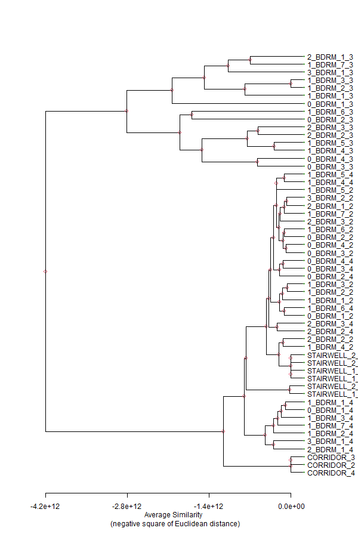

```{r setup, include=FALSE}
knitr::opts_chunk$set(echo = TRUE)
library(tidyverse)
```

## Clear global env and report

```{r include=FALSE}
rm(list = ls())
gc()
```

# Intro

This is my thrid attempt at clustering of zones using the ideal air loads output variable. First I tried 3-space, then I  tried 364-space clustering. Confident in the speed of computation, I'm going to try all hours in the simulation year, 8760-space clustering.

## Import Rda data

```{r import, message=FALSE, warning=FALSE}
load(file = "ilas_nodhw.Rda")
load(file = "ilas_dhw_novar.Rda")
load(file = "hvac_dhw_novar.Rda")
load(file = "hvac_dhw_var.Rda")

```


# Feature normalization

Normalize values by floor area of the respective zone.

```{r}

```


# Clustering

You might think that they would only be heating loads on the winter extreme day, but in this building type and climate, we find that there is more building cooling load [J] than heating load even during winter.

Traditionally, we would remove columns with zero variance as they are unhelpful in the sense of regression. However, in clustering we may want to leave them in.

## Transpose and cluster

Let's introduce the `apcluster` package which is an implementation of Frey and Dueck's popular Affinity Propagation method for passing messages between pairs of data. I would make sure to reference the [math paper](https://doi.org/10.1080/19401493.2017.1410572), the [R package](https://doi.org/10.1093/bioinformatics/btr406), and the [original method's](https://doi.org/10.1126/science.1136800) publication.


```{r turnkey data preprocess}
# CHANGE DATA HERE
df <- ilas_nodhw

# drop time date cols in
# preparation for clustering
if ("minute" %in% colnames(df)) {
  df <- subset(df, select = -c(day, hour, month, minute))
} else {
  df <- subset(df, select = -c(day, hour, month))
}

tdf <- as.data.frame(t(df))

library(apcluster)
APR <- apcluster(negDistMat(r=2), tdf, details = TRUE) # returns a APResult
APR@clusters

# first identify the exemplars
APR@exemplars # returns named index
tdf[APR@exemplars]

APR@idx # returns the paired exemplar index

area_map <- read_csv("ZoneFloorArea-Map.csv")

idx_f <- function(string) { # takes zone string and maps to zone index in area_map
  which(string==area_map$`Zone List`) # returns num vec
  }

# this creates the scalar vector
# but does not apply the scalar on the df yet
scalars <- vector(mode = "numeric")
for (i in 1:length(APR@clusters)) { # iterate through each cluster
  # get list of members of cluster i # char vec
  member_zone_names <- names(unlist(APR@clusters[i])) # inclusive of exemplar
  # map strings to m2 values # num vec
  area_idx <- sapply(member_zone_names, idx_f) # maps cluster idx to area idx
  # get floor area num values
  member_area_num <- area_map$`Space Area [m2]`[area_idx] # num vec
  # create scalar and append to num vec in order of clusters i
  # sum area numbers
  scalars <- append(scalars, sum(member_area_num))
}

# reduce dimensionality of 'df' using clusters
red_df <- df[APR@exemplars] # returns 8760 rows with reduced columns

# apply scalar vec from above to red_df
# is the scalar of the right length?
ncol(red_df) == length(scalars)

# apply area scalars to reduced df
red_df <- sweep(red_df, 2, scalars, FUN = "*")

# change units
rownames(red_df) <- str_replace(rownames(red_df),"J/m\\^2","J")


```


```{r eval=TRUE, warning=FALSE, include=TRUE}
library(apcluster)

# transpose, observations are now parameters, vice versa
a <- t

# observations are zones, parameters are select hours
apres1 <- apcluster::apcluster(negDistMat(r=2), a, details = TRUE)
num_clust <- length(apres1@clusters)
apres1
plot(apres1)

# illustrative purposes only
# use apcluster's plot(apdata, data) scatterplot overlay
# need to alter t(a) so variables have better names

#apcluster::plot(apres1, a)

# use apcluster::aggExCluster() for agglomerative dendogram
aggres1 <- aggExCluster(negDistMat(r=2), a)
plot(aggres1)
```

```{r}
# remove plot title
# righthand labs getting cut off
png(filename = "Horz_dendo_3.png", width = 600, height = 900, units = "px")
# mar=c(bot,left,top,right)
par(mar=c(5.1,4.1,4.1,5.1))
plot(aggres1, main = NULL, xlab = "Average Similarity \n (negative square of Euclidean distance)", nodePar = list(pch = c(1,NULL), cex = .6*2:1, col = 2:3, lab.cex = c(2,1)),
     horiz = TRUE)
# http://www.sthda.com/english/wiki/beautiful-dendrogram-visualizations-in-r-5-must-known-methods-unsupervised-machine-learning
dev.off()
```


The height variable is maybe similarity or affinity? The height determines the threshold at which to cut the tree (can also specify k clusters).

The heights of the merges in the dendrogram correspond to the merging objective: the higher the vertical bar of a merge, the less similar the two clusters have been. The dendrogram, therefore,
clearly indicates *X* clusters.

### apcluster::aggExCluster

#### Details
aggExCluster performs agglomerative clustering. Unlike other methods, e.g., the ones implemented in hclust, aggExCluster is computing exemplars for each cluster and its merging objective is geared towards the identification of meaningful exemplars, too.


...Then the average similarity of the exemplar with all samples in the **first cluster** and the average similarity with all samples in the **second cluster** is computed. These two values measure how well the joint exemplar describes the samples in the two clusters.

The merging objective is finally computed as the **average** of the two measures above. Hence, we can consider the merging objective as some kind of “balanced average similarity to the joint exemplar”.


aggExCluster can be used in two ways, either by performing agglomerative clustering of an entire data set or by performing agglomerative clustering of data previously clustered by affinity propagation or another clustering algorithm.


```{r}
# try phylogram
# looks clipped in IDE but compiles just fine
library(ape)
hc <- as.hclust(aggres1)

# Cut the dendrogram into 4 clusters
#colors = c("red", "blue", "green", "black")
colors = 1:num_clust
clus = stats::cutree(hc, num_clust)
par(xpd = TRUE) # b, l, t, r
plot(as.phylo(hc), type = "fan", tip.color = colors[clus],
     label.offset = 0.05, cex = 0.5)
```


Clustering in 8760-space was still relatively fast. This is good news. Perhaps I should look into the original Frey and Dueck paper for notes on the computational limiting factors.

I think the agglomerative tree diagram is informative. The exemplar-based agglomerative clustering result is a large digital object at 674 KB, in taxonomical terms, this reminds me of a random forest method. See the help entry `help("aggExCluster)` and its simpler counterpart `help("hclust")`.

Talk about the distance matrix / similarity matrix computation. This implementation of `negDistMat()` uses the negative square of Euclidean distances to compute dissimilarity. Other options for computing (dis)similarity are available to the `apcluster` method including:

* Euclidean `method = "euclidean"`
* Maximum `method = "maximum"`
* Sum of absolute distances `method = "manhattan"`
* Canberra `method = "canberra"`
* Minkowski `method = "minkowski"`
* Discrepancy `method = "discrepancy"`


# End

<br><br><br>